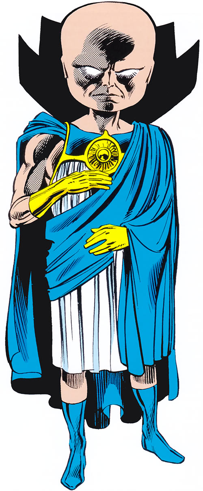

# The Watcher

Observe the JVM ecosystem in Github without any intervention in some Categories.



## How to show website

```bash
jwebserver -p 8005 -d "$(pwd)/docs/"
open http://localhost:8005
```

## References

- https://en.wikipedia.org/wiki/Watcher_(comics)
- https://developer.github.com/v3/

Powered by [Cursor](https://www.cursor.com/)
